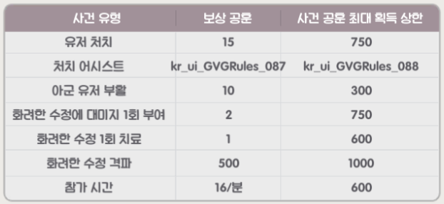
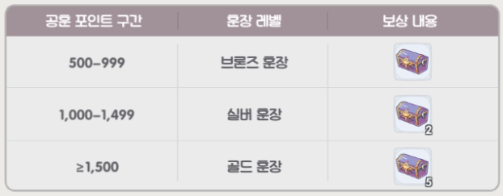
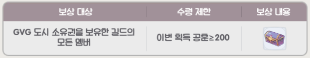

## [ **참여해주세요** ] \*\*

### [디스코드(링크)](https://discord.gg/4eknzcqvJT)

### [카카오톡 - 공지방(링크)](https://open.kakao.com/o/glWqUEZe)

### [카카오톡 - 대화방(링크)](https://open.kakao.com/o/g4XHibXe)

- 공지방 참여코드 : 0908
- 대화방 참여코드 : 0908


---

## [ **길드소개** ]

> 길드장 : **eD아담**
>
> 부길드장 : **달님몬,** **려늬** 
>
> 길드운영진 : **대표** 

```
  에덴길드는 소통/ 접률 / 공성참여를 중시하는 길드입니다.

  오래도록 같이 플레이할 수 있는 끈끈함을 바탕으로 단합되고 즐거운 길드가 될 수 있도록 운영하겠습니다.
```

## [ **가입조건** ]

- 레벨 제한 : **52렙**
- 가입 제한 : 부계정 / 이중 길드
- 필수 조건 : 카카오톡(공지방 / 대화방), 디스코드(듣기) 참여 가능


## [ **길드규칙** ]

- 길드출석

  _사유없는 1일이상 미접은 제명_

- 길드주문 : 1일 기본(8회) 필수

- 길드 내 외로 분란을 일으키는 행동( 비매너 채팅) 3회 : 제명

  _길드 규칙을 위반하는 멤버는 운영진 결정에 의해 제명_

- 길드 컨텐츠(길드KVM, 이계의문 등) 참여 : 필수

  _개인사정인한 컨텐츠 미참여 : 운영진에게 사전통보_<br />
  _사유없이 무단으로 1주 컨테츠 1회이상 미참 제명_
  
  - 길드 컨텐츠(공성전GVG) 참여 : 필수

  _개인사정인한 컨텐츠 미참여 : 운영진에게 사전통보_<br />
  _사유없이 무단으로 2주 컨테츠 1회이상 미참 제명_

- 길드 컨텐츠 GVG 진행시 디스코드(듣기) : 필수

- 길드추방대상

  _사유없는 1일이상 미접_<br />
  _KVM, 이계의문 1주일 1회이상 미참여자_<br />
  _공성2주이상 미참여자_<br />
  _주간공헌 40미만자_
  
  ---

## [ **컨텐츠 진행시간** ]

<table class="tg">
<thead>
  <tr>
    <th class="tg-c4ow">구분</th>
    <th class="tg-c4ow">화요일</th>
    <th class="tg-c4ow">목요일</th>
    <th class="tg-c4ow">토요일</th>
    <th class="tg-baqh">일요일</th>
  </tr>
</thead>
<tbody>
  <tr>
    <td class="tg-c4ow">21:00 ~ 21:45</td>
    <td class="tg-c4ow"></td>
    <td class="tg-c4ow"></td>
    <td class="tg-c4ow">공성전GVG</td>
     <td class="tg-c4ow"></td>
  </tr>
  <tr>
    <td class="tg-c4ow">21:30 ~ 23:00</td>
    <td class="tg-c4ow">길드KVM</td>
    <td class="tg-c4ow">길드KVM</td>
    <td class="tg-c4ow"></td>
    <td class="tg-c4ow">길드KVM</td>
  </tr>
</tbody>
</table>
- 이계의문은 길드 진행도에 따라 오픈 1일전 공지

---

## [ **컨텐츠 -  길드 kvm** ]


### 시즌규정

1. 한 시즌의 기간은 7일이며, 7일마다 총 포인트 랭킹을 결산해 보상을 발송합니다.
2. 시즌 포인트 결산 시간: 일요일 밤 23시 정각
3. 시즌 포인트 초기화 시간 : 월요일 5시 정각
4. 시즌 보상 발송 방식: 개인 랭킹 보상은 우편으로 발송되며, 길드 랭킹 보상은 창고로 발송되어 길드장이 분배합니다.

### 콘텐츠 규정

1. 참가 레벨 : Lv.40
2. 길드 KVM 오픈일 : 화/목/일
3. 길드 KVM 오픈시간 :  21:30~23:00

---

## [ **컨텐츠 -  이계의 문** ]


### 수집 단계

1. 길드 2레벨 달성 후 길드 주문을 건네면 이계의 문 오픈시 필요한 이계 에너지를 획득할 수 있습니다.
2. 이계 에너지가 오픈조건을 충족하면 이벤트가 오픈됩니다.
3. 신규 길드원은 가입 후 72시간 내에 길드 주문을 건네도 이계 에너지를 획득할 수 없습니다.
4. 이계 에너지 100,000 달성 시 주문을 건네도 이계 에너지를 획득할 수 없습니다.

### 전투 오픈

1. 오픈 조건 충족 후, 길드장은 길드의 해당 NPC에게 내일 전투 시간을 예약할 수 있습니다.
2. 예약 성공 후 해당하는 이계 에너지가 차감됩니다. 전투는 예약 시간대에 정확하게 시작됩니다.

### 전투 단계

1. 전투단계 시작 시 첫번째 보스가 갱신됩니다. 전투는 1대 다수 방식으로 진행됩니다. 보스 1마리를 처치할 때마다 다음 보스가 10초 후에 갱신됩니다.
2. 보스 1마리를 처치할 때마다 개인보상과 길드보상을 획득합니다.
3. 전투 단계 종료 후 미처치한 보스는 퇴장 단계 종료시까지 계속 존재합니다.(전투 단계 종료 후 5분) 해당 시간 동안 보스를 처치해도 보상을 획득할 수 있습니다.
4. 신입 길드원은 가입 후 72시간 동안 이계의 문 전토에 참가할 수 없습니다.

### 보상 분배

1. 전투 보상은 개인 보상과 길드보상으로 나뉩니다.
2. 개인 보상은 보스 1마리 처치 시 바로 획득 / 길드 보상은 보스 1마리 처치 시 길드 창고로 발송 후 길드장이 분배
-   1~8 라운드 개인보상 1 / 길드보상 4
-  9~16 라운드 개인보상 2 / 길드보상 8 
- 17~24 라운드 개인보상 2 / 길드보상 12
- 25~32 라운드 개인보상 2 / 길드보상 16

---

## [ **컨텐츠 -  길드 GVG** ]


### 참가 규칙

1. 오픈시간 : 길드전은 매주 토요일 21:00~21:45에 진행됩니다.
2. 참가자격 : Base레벨 35 및 길드에 가입한 모험가는 모두 참가할 수 있습니다.

### 이벤트 입구

1. 이번 이벤트에 길드 쟁탈 거점 도시 5개가 오픈됐습니다.
2. 모험가들은 GVG 전투 정보의 [네비게이션] 기능으로 편리하게 전장 입구로 이동 할 수 있습니다.
3. 길드 탈퇴 후 7일동안 GVG 전장에 참가할 수 없습니다.

### 콘텐츠 소개

1. 거점 내 가장 갚은 곳의 화려한 수정을 먼저 격파하는 길드는 거점 수비권을 획득합니다.
2. 전장 종료 시 거점 수비권을 보유한 길드가 승리하며 해당 거점의 소유권을 획득합니다.

### 전장모드 소개

- 쟁탈전 모드
1. 모드 지속시간은 15분이며, 공격측과 수비측으로 나뉩니다.
2. 거점 수비권을 보유한 길드가 수비측이며, 다른길드는 공격측 입니다.
3. 공격측 : 15분 내에 화려한 수정을 격파하는 길드는 거점 수비권을 획득하며, 쟁탈전 모드 시간이 초기화 됩니다.
4. 수비측 : 15분 동안 화려한 수저이 격파되지 않도록 수비하면 승리하여 거점을 점령하며, 해당 거점의 입구가 닫힙니다.

- 수비전 모드
1. 다음 GVG 이벤트 오픈 시 거점한 길드는 수비측이 됩니다.
2. 모드 지속 시간은 45분이며, 공격측과 수비측으로 나뉩니다.
3. 공격측 : 45분 내에 화려한 수정을 격파하는 길드는 거점 수비권을 획득하며, 쟁탈전 모드 시간이 초기화 됩니다.

### 군신 제단 소개

1. 수비전, 쟁탈전 모드의 필드 내에서 군신 제단이 출현합니다.
2. 공격측이나 수비측의 구성원이 제단 구역에 입장하면 제단 진행도가 증가합니다.
3. 제단 점령에 성공하면 제단 내 동일 세력 구성원에게 군신의 축복 효과를 부여하고 부활 제재를 제거합니다.

### 승리 판정

1. 이벤트 종료시 전장모드에 따라 소유권이 판정됩니다.
- 피점령 모드 : 성을 점령한 길드가 도시의 소유권을 획득합니다.
- 쟁탈전 모드 : 수비측 길드가 도시의 소유권을 획득합니다.
- 수비전 모드 : 수비측 길드가 도시의 소유권을 획득합니다.
- 공성전 모드 : 중립 상태를 유지합니다.

### 이벤트 제한

1. 전장에서 파리의 날개, 나비의 날개를 사용할 수 없습니다.
2. 전장에서 이그드라실의 열매 / 이그드라실의 씨앗 / PVE포션을 사용할 수 없습니다.
3. 전장에서 2회 사망 간격이 60초 미만이면 페널티를 받으며, 부활 시 허약 상태가 됩니다.
4. 여러 거점을 점령할 수 있습니다.

### 이벤트 보상

- 공훈보상




- 도시점령보상



---

## 팁

## [공식라운지](https://game.naver.com/lounge/RAGNAROK_X_Next_Generation/home)

## [인포사이트](https://ragnarokx.skychaserguild.com/rox-monster-database)
